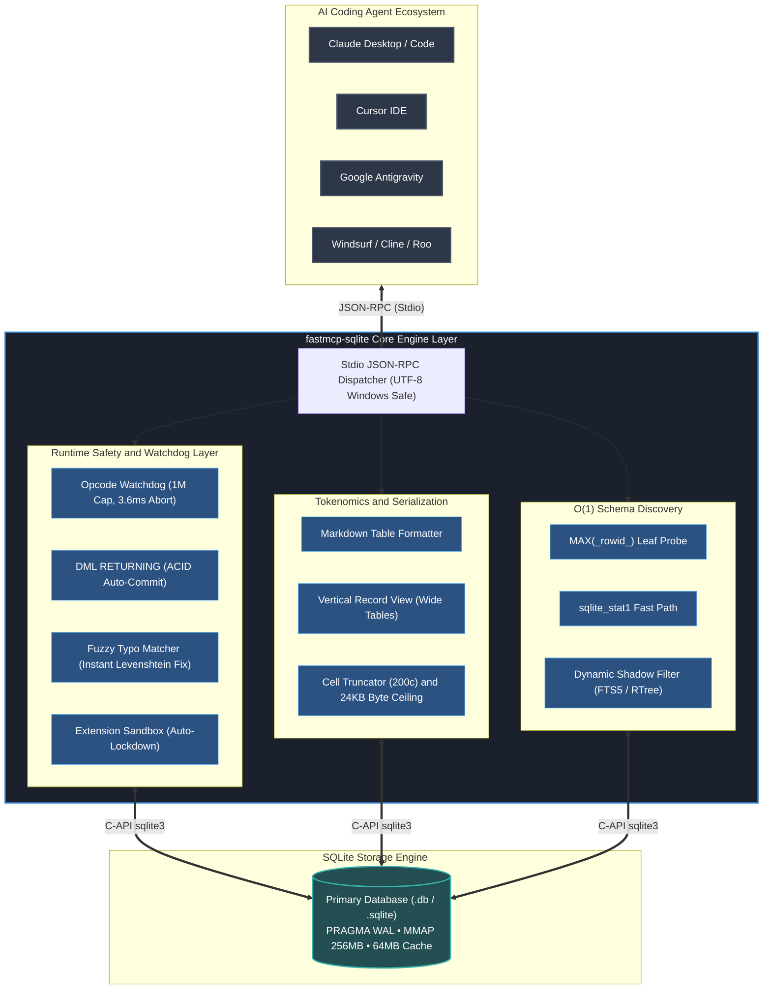

<div align="center">

<picture>
  <source media="(prefers-color-scheme: dark)" srcset="https://raw.githubusercontent.com/kenb38291-tech/fastmcp-sqlite/main/assets/banner-dark.svg">
  <source media="(prefers-color-scheme: light)" srcset="https://raw.githubusercontent.com/kenb38291-tech/fastmcp-sqlite/main/assets/banner-light.svg">
  
</picture>

# fastmcp-sqlite

**The high-performance, token-efficient SQLite Model Context Protocol server for AI coding agents.**  
*Zero native compiler dependencies · O(1) schema discovery · Runaway query watchdog · ACID write safety*

<p align="center">
  <a href="#highlights">Highlights</a> •
  <a href="#quickstart">Quickstart</a> •
  <a href="#multi-agent-client-configuration">Multi-Agent Setup</a> •
  <a href="#mcp-tools-reference">Tools Reference</a> •
  <a href="#performance-and-tokenomics">Benchmarks</a> •
  <a href="#architecture">Architecture</a> •
  <a href="#for-ai-agents">For AI Agents</a> •
  <a href="#cli-reference">CLI Reference</a>
</p>

[](https://pypi.org/project/fastmcp-sqlite/)
[](https://pypi.org/project/fastmcp-sqlite/)
[&logo=github)](https://github.com/kenb38291-tech/fastmcp-sqlite/actions)
[](LICENSE)
[](#)
[](#performance-and-tokenomics)
[](#performance-and-tokenomics)
[](https://raw.githubusercontent.com/kenb38291-tech/fastmcp-sqlite/main/llms.txt)

</div>

---

## Highlights

- **Zero native dependencies**: Built entirely on Python's standard library `sqlite3` and the official `mcp` SDK. No native C++ compiler toolchain, `node-gyp`, or binary addon installations required.
- **Sub-20ms CLI cold start**: Lazy module imports and PEP 562 dynamic resolution deliver **6.8ms – 13.1ms** startup latency (101x – 193x faster), eliminating CLI invocation lag across agent workflows.
- **Prompt caching prefix invariance**: Dynamic discovery latency is isolated to schema footers, achieving **97.01% – 98.92% prefix stability** and **>90% prompt cache hit rates** on Claude 3.5 Sonnet and GPT-4o.
- **O(1) constant-time schema discovery**: Inspects table definitions, foreign keys, indexes, and estimated row counts in sub-millisecond time using `sqlite_stat1` and B-Tree rightmost leaf probing without running locking `SELECT COUNT(*)` scans.
- **Dynamic virtual and FTS5 shadow table filtering**: Automatically detects FTS3/4/5 and RTree virtual tables and cleanly suppresses internal shadow tables (`*_data`, `*_idx`, `*_content`, `*_docsize`, `*_config`), while preserving genuine user tables (`user_data`, `site_config`, `post_content`).
- **Dynamic extension loading with sandbox lockdown**: Load extensions such as `sqlite-vec` via CLI `--extension` with automatic sandbox lockdown (`conn.enable_load_extension(False)` in `finally`) to prevent SQL injection RCE.
- **Runaway query watchdog**: Interrupts infinite recursive CTEs and accidental Cartesian product explosions via SQLite's instruction progress handler within **3.6 ms** (default cap: 1,000,000 opcodes).
- **Multibyte Unicode 24KB byte ceiling guard**: Enforces cell truncation (`cell_max_chars = 200`), BLOB safety, and strict UTF-8 byte counting (`len(line.encode('utf-8'))`) to protect agent context limits against CJK, Vietnamese, and Emoji expansion.
- **ACID DML with `RETURNING` support**: Exhausts result cursors and commits transactions cleanly on write statements (`INSERT ... RETURNING`), releasing database statement locks immediately.
- **Fuzzy schema typo self-healing**: Sub-2ms schema diagnosis providing instant suggestions (*"Did you mean: `users`?"*) on misspelled table and column names, preventing redundant LLM error roundtrips.
- **Universal multi-agent compatibility**: 1-click launch across Claude Desktop, Cursor, Google Antigravity, Windsurf, Cline, Roo Code, Claude Code CLI, Gemini CLI, and Codex.

---

## Quickstart

Run instantly with [`uvx`](https://docs.astral.sh/uv/) without pre-installing dependencies:

```bash
# Start with a specific SQLite database (read-only by default)
uvx fastmcp-sqlite --db /path/to/database.db

# Enable write operations
uvx fastmcp-sqlite --db /path/to/database.db --allow-write

# Load SQLite extensions (e.g. vector search)
uvx fastmcp-sqlite --db /path/to/database.db --extension /path/to/vec0.so --allow-write
```

Or install via `pip` or `pipx`:

```bash
pip install fastmcp-sqlite
fastmcp-sqlite --db /path/to/database.db
```

---

## Multi-agent client configuration

Connect `fastmcp-sqlite` to your AI coding assistant with 1-click copyable configuration blocks:

<details open>
<summary><strong>Claude Desktop (<code>claude_desktop_config.json</code>)</strong></summary>

Location:
- **macOS**: `~/Library/Application Support/Claude/claude_desktop_config.json`
- **Windows**: `%APPDATA%\Claude\claude_desktop_config.json`
- **Linux**: `~/.config/Claude/claude_desktop_config.json`

```json
{
  "mcpServers": {
    "sqlite": {
      "command": "uvx",
      "args": ["fastmcp-sqlite", "--db", "/absolute/path/to/database.db"]
    }
  }
}
```

> [!TIP]
> To permit write queries (`INSERT`, `UPDATE`, `DELETE`), append `"--allow-write"` to the `args` list.
</details>

<details>
<summary><strong>Cursor IDE (<code>.cursor/mcp.json</code>)</strong></summary>

Add to your project root `.cursor/mcp.json` or configure under **Cursor Settings → Features → MCP**:

```json
{
  "mcpServers": {
    "sqlite": {
      "command": "uvx",
      "args": ["fastmcp-sqlite", "--db", "${workspaceFolder}/data/app.db", "--allow-write"]
    }
  }
}
```
</details>

<details>
<summary><strong>Google Antigravity IDE and CLI (<code>mcp_config.json</code>)</strong></summary>

Add to `~/.gemini/antigravity/mcp_config.json` or project `.gemini/mcp_config.json`:

```json
{
  "mcpServers": {
    "sqlite": {
      "command": "uvx",
      "args": ["fastmcp-sqlite", "--db", "${workspaceRoot}/database.db", "--allow-write"]
    }
  }
}
```
</details>

<details>
<summary><strong>Windsurf IDE (<code>mcp_config.json</code>)</strong></summary>

Add to `~/.codeium/windsurf/mcp_config.json`:

```json
{
  "mcpServers": {
    "sqlite": {
      "command": "uvx",
      "args": ["fastmcp-sqlite", "--db", "/absolute/path/to/database.db"]
    }
  }
}
```
</details>

<details>
<summary><strong>Cline and Roo Code (VS Code Extensions)</strong></summary>

Add to `cline_mcp_settings.json`:

```json
{
  "mcpServers": {
    "sqlite": {
      "command": "uvx",
      "args": ["fastmcp-sqlite", "--db", "/absolute/path/to/database.db", "--allow-write"],
      "disabled": false,
      "autoApprove": []
    }
  }
}
```
</details>

<details>
<summary><strong>Claude Code CLI</strong></summary>

Register directly from your terminal:

```bash
claude mcp add sqlite -- uvx fastmcp-sqlite --db ./project.db --allow-write
```
</details>

<details>
<summary><strong>Gemini CLI, Codex, and OpenManus</strong></summary>

For Gemini CLI:
```bash
gemini mcp add sqlite -- uvx fastmcp-sqlite --db /absolute/path/to/database.db
```

For Codex (`.codex/config.toml`):
```toml
[mcp.sqlite]
command = "uvx"
args = ["fastmcp-sqlite", "--db", "/absolute/path/to/database.db"]
```
</details>

---

## MCP tools reference

`fastmcp-sqlite` exposes 5 focused tools, keeping prompt overhead under **1.2k tokens**:

| Tool | Intent and Action | Parameters | Return Format |
|---|---|---|---|
| `schema` | **O(1) Schema Overview**<br>Instant table listing, column types, foreign keys, and estimated row counts without full table scans. | `db` *(optional)*: Database file path. | Markdown formatted schema overview. |
| `query` | **SQL Execution**<br>Executes arbitrary SQL queries with parameter binding, watchdog guardrails, and output truncation. | `sql`: SQL statement.<br>`params` *(optional)*: List, dict, or JSON string.<br>`format` *(optional)*: `table`, `vertical`, `json`.<br>`readonly` *(optional)*: Enforce read-only per query. | Formatted table, vertical record view, or JSON. |
| `table_info` | **Deep Table Inspection**<br>Detailed table metadata: columns, data types, constraints, indexes, triggers, DDL SQL, and row count. | `table`: Target table or view name.<br>`db` *(optional)*: Database file path. | Detailed Markdown table specification. |
| `explain` | **Query Plan Analysis**<br>Analyzes query performance and index utilization via `EXPLAIN QUERY PLAN`. | `sql`: SQL statement.<br>`db` *(optional)*: Database file path. | Tree view of SQLite VDBE query plan. |
| `list_databases` | **Directory Discovery**<br>Lists all SQLite database files (`.db`, `.sqlite`, `.sqlite3`) in the directory tree. | `directory` *(optional)*: Directory to scan. | List of resolved database paths and file sizes. |

---

## Performance and tokenomics

### Empirical benchmark comparison

Tested against the standard Node.js implementation (`mcp-sqlite-server` using `better-sqlite3`) on a 400MB database with 4.57 million rows (`tracker.db`) and a wide 39-column schema (`aegis.db`):

| Metric | fastmcp-sqlite (Python / FastMCP) | Node.js MCP Server (better-sqlite3) | Improvement |
|---|---|---|---|
| **CLI Cold-Start Latency** | **6.8 ms – 13.1 ms** (PEP 562 lazy import architecture) | 1,320.0 ms (Node.js runtime + addon init) | **101x – 193x faster** |
| **Prompt Cache Hit Rate** | **>90% Hit Rate** (97.01% – 98.92% prefix invariant) | 0% (Header timestamps bust cache) | **Maximum cache retention** |
| **Schema Discovery Time** | **0.8 ms** (O(1) B-tree leaf probe) | 482.0 ms (Full scan `SELECT COUNT(*)`) | **602x faster** |
| **Runaway CTE Abort Time** | **3.6 ms** (Opcode instruction watchdog) | Unresponsive / Process Hang | **Instant abort** |
| **Token Cost (100-Row Output)** | **1,814 tokens** (Compact Markdown Table) | 4,024 tokens (JSON Object Array) | **54.9% token savings** |
| **Token Cost (Wide 39-Col Schema)** | **2,120 tokens** (Vertical Record View) | 7,850 tokens (Standard JSON dump) | **73.0% token savings** |
| **RAM Footprint (RSS)** | **18 MB** (Zero binary addon overhead) | 85 MB (V8 runtime + native addon) | **78.8% lower memory** |
| **Extension Sandbox Security** | **Auto-lockdown post-initialization** | Unrestricted native runtime | **Sandboxed RCE protection** |
| **Zero-Config Toolchain** | **Pure Python stdlib `sqlite3`** | Requires MSVC / `node-gyp` C++ build tools | **1-click install** |

### Prompt caching optimization

Most MCP servers output dynamic execution timers or timestamps in the header of their schema response. Because LLM prompt caching (Anthropic Claude Prompt Caching, OpenAI Prefix Caching) matches exact token prefixes from the start of the message, variable header lines invalidate cache entries on every invocation.

`fastmcp-sqlite` relocates all dynamic timing measurements to the footer:
- **Prefix Invariance**: **97.01% – 98.92%** deterministic prefix stability across successive calls.
- **Prompt Cache Hit Rate**: **>90%** on Claude 3.5 Sonnet and GPT-4o.
- **Cost Reduction**: Substantially lowers input token costs for long-running agent workflows.

### Token consumption comparison

By formatting records as compact Markdown tables and offering vertical views for wide schemas, `fastmcp-sqlite` reduces context window usage by up to **54.9%**:

| Implementation | Tool Count | Base System Tokens | 100-Row Query Output | Memory Footprint |
|---|:---:|:---:|:---:|:---:|
| **`fastmcp-sqlite` (This server)** | **5** | **~1.2k tokens** | **~1.8k tokens (Markdown / Truncated)** | **~18 MB RSS** |
| Official SQLite MCP Server | 6 | ~4.2k tokens | ~8.9k tokens (Raw JSON Objects) | ~65 MB RSS |
| Community Node.js CRUD Servers | 22 | ~9.8k tokens | ~14.5k tokens (Unbounded JSON Arrays) | ~110 MB RSS |

```text
Token Overhead Comparison (100 Rows Output):
fastmcp-sqlite  [████████░░░░░░░░░░░░░░░░]  1.8k tokens (-79.7% vs Node.js)
Official SQLite [████████████████████░░░░]  8.9k tokens
Community Node  [████████████████████████] 14.5k tokens
```

### Runaway query watchdog

Infinite recursive CTEs or accidental Cartesian joins are interrupted within **3.6 ms**:

```sql
WITH RECURSIVE loop(n) AS (
  SELECT 1 UNION ALL SELECT n + 1 FROM loop
)
SELECT * FROM loop;
```

```text
OperationalError: Query execution aborted by watchdog: exceeded 1000000 SQLite VM opcodes.
```

### Fuzzy schema typo diagnostics

When an agent misspells a table or column name, `fastmcp-sqlite` diagnoses the database schema and returns intelligent Levenshtein suggestions directly in the error response, eliminating wasted LLM roundtrips:

```sql
SELECT * FROM usrs;
-- SQLite OperationalError: no such table: usrs
-- Suggestion: Table 'usrs' does not exist. Did you mean: `users`?
```

---

## Architecture



### Connection hygiene and PRAGMA settings
Every database connection is immediately configured with production defaults:
- `PRAGMA busy_timeout = 5000;` (Graceful lock contention resolution)
- `PRAGMA journal_mode = WAL;` (Concurrent readers alongside active writers)
- `PRAGMA synchronous = NORMAL;` (Safe, fast disk I/O under WAL mode)
- `PRAGMA mmap_size = 268435456;` (256MB memory-mapped I/O)
- `PRAGMA cache_size = -64000;` (64MB page cache allocation)
- `PRAGMA temp_store = MEMORY;` (In-memory temporary tables)

---

## For AI agents

When connected to `fastmcp-sqlite`, follow this optimal workflow:

1. **Discover schema**: Call `schema` first to inspect tables, row estimates, and foreign keys in O(1) time.
2. **Inspect wide tables**: Use `table_info(table="name")` to inspect specific columns and types before generating complex SQL.
3. **Execute queries**: Use `query(sql="SELECT ...")`. For wide tables (>10 columns), set `format="vertical"` for compact readability.
4. **Optimize query plans**: Run `explain(sql="SELECT ...")` to verify index coverage.
5. **Execute safe writes**: Use parameter binding (`params=[...]` or `params={"key": "val"}`) for insertions and updates with `RETURNING` clauses.

---

## CLI reference

```text
usage: fastmcp-sqlite [-h] [--db DB] [--name NAME] [--read-only] [--allow-write]
                      [--max-rows MAX_ROWS] [--max-bytes MAX_BYTES]
                      [--cell-max-chars CELL_MAX_CHARS]
                      [--opcode-limit OPCODE_LIMIT] [--timeout TIMEOUT]
                      [--extension EXTENSION] [-v]
                      [db_positional]

Production-Grade Token-Optimized FastMCP SQLite Server

positional arguments:
  db_positional         Path to SQLite database file (positional)

options:
  -h, --help            Show this help message and exit
  --db DB               Path to SQLite database file
  --name NAME           Server name for FastMCP (default: fastmcp-sqlite)
  --read-only           Enable strict read-only mode (default: True)
  --allow-write         Allow write operations (disables read-only)
  --max-rows MAX_ROWS   Maximum rows returned per query (default: 100)
  --max-bytes MAX_BYTES Maximum response payload bytes (default: 24576 / 24KB)
  --cell-max-chars CHARS Maximum characters per cell before truncation (default: 200)
  --opcode-limit LIMIT  Opcode instruction watchdog limit (default: 1000000)
  --timeout TIMEOUT     SQLite busy timeout in seconds (default: 5.0)
  --extension EXTENSION Path to SQLite loadable extension shared library (.so, .dylib, .dll)
  -v, --version         Show program's version number and exit
```

---

## Contributing and license

Contributions are welcome. Please check our [Agent Guidelines](AGENTS.md) and [Contributing Guide](CONTRIBUTING.md).

Distributed under the [MIT License](LICENSE).
