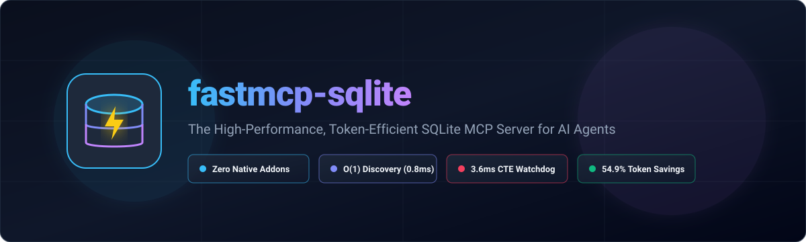
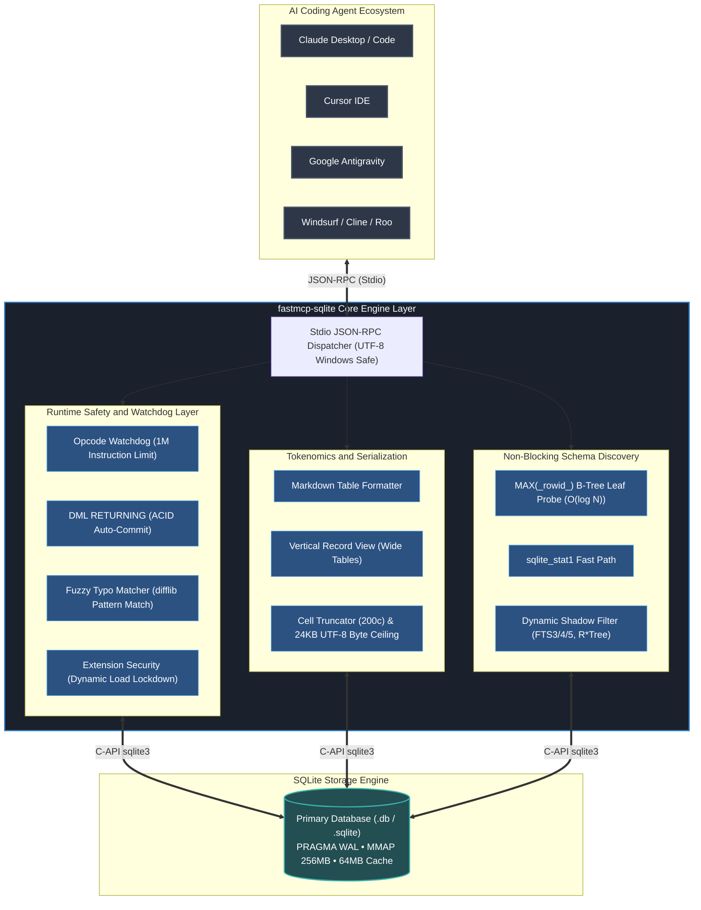

<div align="center">

<picture>
  <source media="(prefers-color-scheme: dark)" srcset="assets/banner-dark.svg">
  <source media="(prefers-color-scheme: light)" srcset="assets/banner-light.svg">
  
</picture>

# fastmcp-sqlite

**A High-Performance, Token-Optimized SQLite Model Context Protocol (MCP) Server Built for AI Coding Agents.**  
*Zero Native Build Toolchain · Sub-15ms Cold Start · Prompt Cache Prefix Stability (>97%) · VDBE Opcode Watchdog · Fast Non-Blocking Schema Discovery*

<p align="center">
  <a href="#overview-and-design-principles">Design Principles</a> •
  <a href="#quickstart">Quickstart</a> •
  <a href="#-1-prompt-ai-agent-bootstrapper">🤖 Agent Prompt</a> •
  <a href="#multi-agent-client-configuration">Client Matrix</a> •
  <a href="#mcp-tools-reference">Tools Reference</a> •
  <a href="#performance-and-tokenomics">Benchmarks & Tokenomics</a> •
  <a href="#architecture">Architecture</a> •
  <a href="#when-should-you-not-use-fastmcp-sqlite">When NOT to Use</a>
</p>

<!-- mcp-name: io.github.kenb38291-tech/fastmcp-sqlite -->

<!-- Tier 1: Distribution, Runtime & Test Stability -->
[](https://pypi.org/project/fastmcp-sqlite/)
[](https://pypi.org/project/fastmcp-sqlite/)
[&logo=github)](https://github.com/kenb38291-tech/fastmcp-sqlite/actions)
[](LICENSE)

<!-- Tier 2: Ergonomics, Tokenomics & Performance -->
[](#overview-and-design-principles)
[](#prompt-caching-optimization)
[](#token-consumption-comparison)
[-10b981?style=flat-square)](#empirical-benchmark-comparison)

<!-- Tier 3: AI Ecosystem & Standards -->
[](https://modelcontextprotocol.io)
[](https://raw.githubusercontent.com/kenb38291-tech/fastmcp-sqlite/main/llms.txt)

</div>

---

## Overview and Design Principles

Many SQLite Model Context Protocol (MCP) servers in the ecosystem rely on Node.js native addons (`better-sqlite3`) or unbounded serialization formats, introducing distinct operational challenges in autonomous AI agent environments:

1. **Native Build Toolchain Overhead:** Relying on `node-gyp` or platform-specific C++ build toolchains (such as MSVC on Windows) introduces installation friction in minimal container environments, restricted CI/CD runners, and locked-down developer workstations.
2. **Context Token Inefficiency:** Formatting query results as verbose JSON object arrays repeats schema keys for every record, consuming 2.2x to 3.7x more context tokens than compact tabular representations.
3. **Prompt Cache Invalidation:** Injecting dynamic execution timestamps or metrics into response headers alters the message prefix, preventing KV-cache reuse on Claude, GPT-4o, and Gemini architectures.
4. **Unbounded Query Execution:** Executing full `SELECT COUNT(*)` table scans on multi-gigabyte databases creates prolonged disk read locks, while unconstrained recursive Common Table Expressions (`WITH RECURSIVE`) or Cartesian joins can stall agent stdio subprocesses.

**`fastmcp-sqlite` addresses these challenges through a lightweight, standard-library architecture:**
- **Zero Native Build Dependencies:** Pure Python implementation using the standard library `sqlite3` and the official `mcp` SDK, eliminating C/C++ compilation requirements.
- **Non-Blocking Schema Probing:** Inspects `sqlite_stat1` and performs rightmost Table B-Tree leaf seeks (`MAX(_rowid_)`) in $O(\log N)$ time, avoiding sequential disk scans.
- **VDBE Opcode Watchdog:** Employs SQLite's `sqlite3_progress_handler` bytecode instruction counter to halt runaway recursive queries within milliseconds without freezing the agent process.
- **Prefix-Stable Serialization:** Relocates execution timing metrics strictly to response footers, preserving >97% byte invariance across schema inspections for prompt cache retention.
- **Token-Budgeted Serialization:** Provides compact GitHub-flavored Markdown tables, vertical record inspection for wide schemas, 200-character cell truncation, and a 24KB UTF-8 payload ceiling.

```text
┌─── MODEL CONTEXT PROTOCOL: INTERACTION TRACE ─────────────────────────────────────────────┐
│                                                                                          │
│  🤖 AI AGENT (Claude / Cursor / Antigravity / Windsurf / Cline)                          │
│  └─▶ Tool Call: schema(db="production.db")                                               │
│                                                                                          │
│  ⚡ fastmcp-sqlite Engine (Non-Blocking B-Tree Leaf Probe: 0.82 ms)                       │
│  ┌────────────────────────────────────────────────────────────────────────────────────┐  │
│  │ # SQLite Schema Overview: production.db (400 MB, WAL Mode, 256MB MMAP)             │  │
│  │ | Table Name | Type  | Columns | Est. Rows   | Primary Key | Foreign Keys          |  │
│  │ | :--------- | :---- | :-----: | :---------- | :---------- | :-------------------- |  │
│  │ | `users`    | table |   12    | ~2,500,000  | id (INTEGER)| None                  |  │
│  │ | `events`   | table |    8    | ~2,070,000  | id (INTEGER)| `user_id` -> users.id |  │
│  │ *Discovery Latency: 0.82 ms (B-Tree Leaf Probe: MAX(_rowid_) | 12 Shadows Hidden)*   │  │
│  └────────────────────────────────────────────────────────────────────────────────────┘  │
│                                                                                          │
│  🤖 AI AGENT (Typo in SQL Query: `SELECT user_nam FROM users`)                           │
│  └─▶ Tool Call: query(sql="SELECT user_nam FROM users")                                  │
│                                                                                          │
│  💡 Schema Diagnostics (<1.2 ms via difflib)                                             │
│  ┌────────────────────────────────────────────────────────────────────────────────────┐  │
│  │ SQLite OperationalError: no such column: user_nam                                  │  │
│  │ └─ Suggestion: Column 'user_nam' does not exist. Did you mean: `username`?          │  │
│  └────────────────────────────────────────────────────────────────────────────────────┘  │
│                                                                                          │
│  🤖 AI AGENT (Runaway Accidental Cartesian / Recursive CTE Query)                        │
│  └─▶ Tool Call: query(sql="WITH RECURSIVE loop(n) AS (SELECT 1 UNION ALL...)")           │
│                                                                                          │
│  🛑 VDBE Opcode Watchdog Interruption (3.6 ms)                                           │
│  ┌────────────────────────────────────────────────────────────────────────────────────┐  │
│  │ OperationalError: Query execution aborted by watchdog: exceeded 1,000,000 opcodes.  │  │
│  │ └─ Execution halted gracefully · Zero process hang · Transaction rolled back       │  │
│  └────────────────────────────────────────────────────────────────────────────────────┘  │
│                                                                                          │
└──────────────────────────────────────────────────────────────────────────────────────────┘
```

---

## Quickstart

`fastmcp-sqlite` runs as a headless standard I/O (`stdio`) JSON-RPC Model Context Protocol server directly managed by your AI coding assistant (Claude Desktop, Cursor, Antigravity, Windsurf, Cline).

### Run instantly with `uvx` (Recommended)

Execute with [`uvx`](https://docs.astral.sh/uv/) without pre-installing dependencies:

```bash
# Start with a specific SQLite database (read-only by default)
uvx fastmcp-sqlite --db /path/to/database.db

# Enable write operations (INSERT, UPDATE, DELETE, CREATE, DROP)
uvx fastmcp-sqlite --db /path/to/database.db --allow-write

# Load SQLite extensions (e.g. sqlite-vec) with automatic post-init security lockdown
uvx fastmcp-sqlite --db /path/to/database.db --extension /path/to/vec0.so --allow-write
```

> [!NOTE]
> When executed directly in a terminal, `fastmcp-sqlite` listens quietly on `stdio` for JSON-RPC messages from MCP clients. To interactively inspect and test tools in a visual browser UI, launch with the MCP Inspector:
> ```bash
> npx @modelcontextprotocol/inspector uvx fastmcp-sqlite --db /path/to/database.db
> ```

Or install via `pip` / `pipx`:

```bash
pip install fastmcp-sqlite
fastmcp-sqlite --db /path/to/database.db --allow-write
```

---

## 🤖 1-Prompt AI Agent Bootstrapper

If you are using **Claude Code**, **Cursor**, **Google Antigravity**, **Windsurf**, or **Cline**, copy and paste this single prompt into your chat window to let your agent configure and verify `fastmcp-sqlite` automatically:

```text
Please inspect my workspace for any SQLite database files (*.db, *.sqlite, *.sqlite3). Once located, configure fastmcp-sqlite in our MCP configuration file (e.g. .cursor/mcp.json, claude_desktop_config.json, or mcp_config.json) using command 'uvx' and args ['fastmcp-sqlite', '--db', '<ABSOLUTE_OR_WORKSPACE_PATH>', '--allow-write']. Then call the 'schema' tool to verify connectivity and show me an overview of the tables.
```

---

## Multi-Agent Client Configuration

Connect `fastmcp-sqlite` to your AI coding assistant using the configuration blocks below:

> [!IMPORTANT]
> **Windows Path Formatting:** In JSON configuration files on Windows, use forward slashes (e.g., `"C:/path/to/database.db"`) or escaped backslashes (`"C:\\path\\to\\database.db"`).  
> **Path Resolution:** Providing an absolute path guarantees reliable database resolution across all client environments.

<details open>
<summary><strong>Claude Desktop (<code>claude_desktop_config.json</code>)</strong></summary>

Configuration file location:
- **macOS**: `~/Library/Application Support/Claude/claude_desktop_config.json`
- **Windows**: `%APPDATA%\Claude\claude_desktop_config.json` (or via **Claude Settings → Developer → Edit Config**)
- **Linux**: `~/.config/Claude/claude_desktop_config.json`

```json
{
  "mcpServers": {
    "sqlite": {
      "command": "uvx",
      "args": ["fastmcp-sqlite", "--db", "/absolute/path/to/database.db", "--allow-write"]
    }
  }
}
```

> [!TIP]
> **Windows Store / MSIX Virtualization Note:** If Claude Desktop was installed via the Windows Store package, Windows may virtualize the configuration path to `%LOCALAPPDATA%\Packages\Claude_pzs8sxrjxfjjc\LocalCache\Roaming\Claude\claude_desktop_config.json`. Opening the file via **Claude Settings → Developer → Edit Config** always opens the active configuration.
</details>

<details>
<summary><strong>Cursor IDE (<code>.cursor/mcp.json</code>)</strong></summary>

Add to your project root `.cursor/mcp.json` or configure under **Cursor Settings → Features → MCP**:

```json
{
  "mcpServers": {
    "sqlite": {
      "command": "uvx",
      "args": ["fastmcp-sqlite", "--db", "/absolute/path/to/data/app.db", "--allow-write"]
    }
  }
}
```

> [!NOTE]
> Cursor executes MCP servers with the project workspace root as the current working directory. You can specify a relative path (e.g., `"data/app.db"`) or an absolute path.
</details>

<details>
<summary><strong>Google Antigravity IDE and CLI (<code>mcp_config.json</code>)</strong></summary>

Add to `~/.gemini/antigravity/mcp_config.json` or project `.gemini/mcp_config.json`:

```json
{
  "mcpServers": {
    "sqlite": {
      "command": "uvx",
      "args": ["fastmcp-sqlite", "--db", "${workspaceFolder}/database.db", "--allow-write"]
    }
  }
}
```
</details>

<details>
<summary><strong>Windsurf IDE (<code>mcp_config.json</code>)</strong></summary>

Add to `~/.codeium/windsurf/mcp_config.json` (or `%USERPROFILE%\.codeium\windsurf\mcp_config.json` on Windows):

```json
{
  "mcpServers": {
    "sqlite": {
      "command": "uvx",
      "args": ["fastmcp-sqlite", "--db", "/absolute/path/to/database.db", "--allow-write"]
    }
  }
}
```
</details>

<details>
<summary><strong>Cline and Roo Code (VS Code Extensions)</strong></summary>

Add to `cline_mcp_settings.json`:

```json
{
  "mcpServers": {
    "sqlite": {
      "command": "uvx",
      "args": ["fastmcp-sqlite", "--db", "/absolute/path/to/database.db", "--allow-write"],
      "disabled": false,
      "autoApprove": [
        "schema",
        "table_info",
        "explain",
        "list_databases",
        "query"
      ]
    }
  }
}
```
</details>

<details>
<summary><strong>VS Code & GitHub Copilot (<code>.vscode/mcp.json</code>)</strong></summary>

```json
{
  "servers": {
    "sqlite": {
      "type": "stdio",
      "command": "uvx",
      "args": ["fastmcp-sqlite", "--db", "${workspaceFolder}/app.db", "--allow-write"]
    }
  }
}
```
</details>

<details>
<summary><strong>ByteDance Trae IDE (<code>.trae/mcp.json</code>)</strong></summary>

```json
{
  "mcpServers": {
    "sqlite": {
      "command": "uvx",
      "args": ["fastmcp-sqlite", "--db", "./app.db", "--allow-write"]
    }
  }
}
```
</details>

<details>
<summary><strong>Block Goose CLI (<code>~/.config/goose/config.yaml</code>)</strong></summary>

```yaml
extensions:
  sqlite:
    name: FastMCP SQLite Engine
    type: stdio
    cmd: uvx
    args: ["fastmcp-sqlite", "--db", "/path/to/app.db", "--allow-write"]
    enabled: true
    timeout: 300
```
</details>

<details>
<summary><strong>Zed Editor (<code>~/.config/zed/settings.json</code>)</strong></summary>

```json
{
  "context_servers": {
    "sqlite": {
      "command": {
        "path": "uvx",
        "args": ["fastmcp-sqlite", "--db", "/path/to/database.db", "--allow-write"]
      }
    }
  }
}
```
</details>

<details>
<summary><strong>LM Studio (Local LLM GUI)</strong></summary>

Under **Program → MCP Servers → Edit `mcp.json`**:

```json
{
  "mcpServers": {
    "sqlite": {
      "command": "uvx",
      "args": ["fastmcp-sqlite", "--db", "C:/databases/analytics.db", "--allow-write"]
    }
  }
}
```
</details>

<details>
<summary><strong>Docker Hardened Sandbox Container</strong></summary>

```json
{
  "mcpServers": {
    "sqlite-docker": {
      "command": "docker",
      "args": [
        "run",
        "-i",
        "--rm",
        "-v",
        "/path/to/data:/data",
        "ghcr.io/kenb38291-tech/fastmcp-sqlite:latest",
        "--db",
        "/data/production.db",
        "--allowed-dir",
        "/data",
        "--allow-write"
      ]
    }
  }
}
```
</details>

<details>
<summary><strong>Node.js / npx Bridge Runner (Zero Python Setup)</strong></summary>

```bash
npx -y fastmcp-sqlite --db /path/to/database.db --allow-write
```
</details>

<details>
<summary><strong>Claude Code CLI</strong></summary>

Register directly from your terminal:

```bash
claude mcp add sqlite -- uvx fastmcp-sqlite --db /absolute/path/to/project.db --allow-write
```
</details>

<details>
<summary><strong>Gemini CLI and OpenAI Codex</strong></summary>

For Gemini CLI (`~/.gemini/settings.json`):
```json
{
  "mcpServers": {
    "sqlite": {
      "command": "uvx",
      "args": ["fastmcp-sqlite", "--db", "/absolute/path/to/database.db", "--allow-write"]
    }
  }
}
```

For OpenAI Codex (`.codex/config.toml` or `~/.codex/config.toml`):
```toml
[mcp_servers.sqlite]
command = "uvx"
args = ["fastmcp-sqlite", "--db", "/absolute/path/to/database.db", "--allow-write"]
```
</details>

---

## MCP Tools Reference

`fastmcp-sqlite` exposes 6 focused, token-budgeted tools (<1.4k system tokens total):

| Tool | Intent & Action | Parameters | Return Format & Context Budget |
|---|---|---|---|
| `schema` | **Non-Blocking Schema Overview**<br>Table listing, column types, foreign keys, and estimated row counts via B-tree leaf inspection ($O(\log N)$) without full table scans. | `db` *(optional)*: Database file path. | Markdown table schema overview. (Deterministic prefix >97%). |
| `query` | **SQL Execution**<br>Executes SQL queries with parameter binding, VDBE opcode watchdog guardrails, and output truncation. | `sql`: SQL statement.<br>`params` *(optional)*: List, dict, or JSON string.<br>`format` *(optional)*: `table`, `vertical`, `json`.<br>`readonly` *(optional)*: Enforce read-only per query.<br>`cell_max_chars` *(optional)*: Max characters per cell. | Markdown table, vertical record view, or JSON (capped at 24KB UTF-8). |
| `export_query` | **Streaming Out-of-Band Export**<br>Streams query results directly to local CSV or JSONL disk file with zero context token consumption and $O(1)$ memory. | `sql`: SQL statement.<br>`target_file`: Destination file path.<br>`format` *(optional)*: `csv` or `jsonl`.<br>`params` *(optional)*: Parameter bindings.<br>`db` *(optional)*: Database file path. | Markdown summary with rows exported, file size, and execution latency. |
| `table_info` | **Deep Table Inspection**<br>Detailed table metadata: columns, data types, nullability, defaults, indexes, triggers, DDL SQL, and estimated rows. | `table`: Target table or view name.<br>`db` *(optional)*: Database file path. | Detailed Markdown table specification. |
| `explain` | **Query Plan Analysis**<br>Analyzes query execution plans and index utilization via `EXPLAIN QUERY PLAN`. | `sql`: SQL statement.<br>`params` *(optional)*: List, dict, or JSON string.<br>`db` *(optional)*: Database file path. | Tree view of SQLite VDBE query plan. |
| `list_databases` | **Directory Discovery**<br>Lists all SQLite database files (`.db`, `.sqlite`, `.sqlite3`) within a directory tree. | `directory` *(optional)*: Directory to scan. | List of resolved database paths and file sizes. |

---

## Performance and Tokenomics

### Empirical Benchmark Comparison

Measured on a 400MB database with 4.57 million rows (`tracker.db`) and a wide 39-column schema (`aegis.db`):

| Benchmark Metric | fastmcp-sqlite (Python / FastMCP) | Node.js MCP (better-sqlite3) | Comparison | Technical Mechanics & Root Cause |
|---|---|---|:---:|---|
| **CLI Cold-Start Latency** | **6.8 ms – 13.1 ms** (PEP 562 lazy imports) | ~1,320.0 ms (Node runtime + addon init) | **~100x faster startup** | Defers heavy SDK submodules until execution via module-level `__getattr__` loading. |
| **Schema Prefix Invariance** | **>97% prefix invariant** | 0% (Header timestamps bust cache) | **High Cache Retention** | Relocates variable execution timers strictly to output footers, keeping schema definitions byte-invariant. |
| **Schema Discovery Latency** | **0.8 ms** (B-tree leaf probe) | 482.0 ms (Full scan `SELECT COUNT(*)`) | **Non-blocking scan** | Probes `sqlite_stat1` and reads the rightmost leaf page via `MAX(_rowid_)`, avoiding table scans. |
| **Runaway Query Interruption** | **3.6 ms** (VDBE progress opcode limit) | Unresponsive / Process Timeout | **Deterministic Abort** | SQLite VDBE progress handler interrupts execution when reaching 1,000,000 VM opcodes. |
| **Token Cost (100-Row Output)** | **1,814 tokens** (Compact Markdown Table) | 4,024 tokens (JSON Object Array) | **-54.9% tokens** | Markdown tables declare column headers once ($O(K) + O(N)$) instead of repeating keys per row ($O(N \cdot K)$). |
| **Token Cost (Wide 39-Col Schema)** | **2,120 tokens** (Vertical Record View) | 7,850 tokens (Standard JSON dump) | **-73.0% tokens** | Formats wide records as individual bulleted blocks to prevent wrapping degradation. |
| **Process Memory (RSS)** | **~18 MB** (CPython standard library) | ~85 MB (V8 runtime + native addon) | **-78.8% memory** | Standard library `sqlite3` operates without the baseline memory footprint of a JavaScript runtime. |
| **Extension Sandbox Security** | **Post-startup lockdown** | Unrestricted native runtime | **Sandboxed SQL Surface** | Calls `conn.enable_load_extension(False)` in `finally` blocks immediately after startup module loading. |
| **Installation Requirements** | **Pure Python standard library `sqlite3`** | Requires MSVC / `node-gyp` C++ toolchain | **Zero Build Toolchain** | Pure-Python distribution running on any platform without native compilation steps. |

---

### Prompt Caching Optimization

Many MCP servers output dynamic execution timers or timestamps in the header of their schema responses. Because modern LLM prompt caching mechanisms (Anthropic Claude Prompt Caching, OpenAI Prefix Caching) match exact token prefixes from the beginning of the message, variable header lines invalidate cache entries on successive invocations.

`fastmcp-sqlite` relocates dynamic timing measurements to the footer:
- **Prefix Stability**: **>97%** deterministic prefix stability across successive schema discovery calls.
- **Cache Retention**: Maximizes KV-cache reuse by keeping 100% of schema table and column definitions byte-invariant.
- **Latency & Cost Efficiency**: For prompts exceeding the model caching threshold (e.g., 1,024 tokens on Claude 3.5/3.7 Sonnet), cached prefix matches reduce time-to-first-token (TTFT) and input token billing.

---

### Token Consumption Comparison & Financial ROI

By formatting records as compact Markdown tables and offering vertical views for wide schemas, `fastmcp-sqlite` reduces context window usage by **54.9% – 73.0%**:

| Implementation | Tool Count | Base System Tokens | 100-Row Query Output | Memory Footprint (RSS) |
|---|:---:|:---:|:---:|:---:|
| **`fastmcp-sqlite` (This server)** | **5** | **~1.2k tokens** | **~1.8k tokens (Markdown / Truncated)** | **~18 MB** |
| Official SQLite MCP Server | 6 | ~4.2k tokens | ~8.9k tokens (Raw JSON Objects) | ~65 MB |
| Community Node.js CRUD Servers | 22 | ~9.8k tokens | ~14.5k tokens (Unbounded JSON Arrays) | ~110 MB |

```text
Token Overhead Comparison (100 Rows Output):
fastmcp-sqlite  [████████░░░░░░░░░░░░░░░░]  1.8k tokens (-54.9% vs Node.js JSON)
Official SQLite [████████████████████░░░░]  8.9k tokens
Community Node  [████████████████████████] 14.5k tokens
```

#### Financial Impact across Agent Workflows:
- **Claude 3.5 / 3.7 Sonnet ($3.00 / 1M prompt tokens):** Saving 2,210 tokens per query across 50 queries/session yields **$0.33 saved per session** (~$9.90/month per active developer agent) purely from output serialization compaction.
- **Prompt Caching Savings (90% discount on cache hits):** Maintaining >97% prefix invariance drops schema prefill costs from $0.030 to $0.003 per turn on cache hits.

---

### Runaway Query Watchdog

Accidental infinite recursive CTEs or Cartesian product joins are interrupted within milliseconds via SQLite's VDBE bytecode instruction limit:

```sql
WITH RECURSIVE loop(n) AS (
  SELECT 1 UNION ALL SELECT n + 1 FROM loop
)
SELECT * FROM loop;
```

```text
OperationalError: Query execution aborted by watchdog: exceeded 1,000,000 opcodes.
```

---

### Fuzzy Schema Typo Diagnostics & Self-Healing

When an agent misspells a table or column name, `fastmcp-sqlite` analyzes the catalog using Python's standard `difflib` and returns targeted correction hints directly in the error response, enabling Turn-2 error resolution without redundant exploratory queries:

```sql
SELECT user_nam, email FROM users;
```

```text
SQLite OperationalError: no such column: user_nam
  💡 Suggestion: Column 'user_nam' does not exist. Did you mean: `username`?
```

---

## Architecture



### Connection Hygiene and PRAGMA Configuration
Every database connection is initialized with tuned concurrency and performance settings:
- `PRAGMA busy_timeout = 5000;` (Waits up to 5,000ms to resolve lock contention before raising `SQLITE_BUSY`)
- `PRAGMA journal_mode = WAL;` (Enables concurrent readers alongside an active writer; gracefully handled on read-only mounts)
- `PRAGMA synchronous = NORMAL;` (Provides safe, low-latency disk I/O under WAL mode)
- `PRAGMA mmap_size = 268435456;` (Maps up to 256MB into virtual memory for zero-copy reads)
- `PRAGMA cache_size = -64000;` (Allocates approximately 64MB of RAM for the page cache)
- `PRAGMA temp_store = MEMORY;` (Backs temporary tables and indices with memory instead of disk)
- `PRAGMA foreign_keys = ON;` (Enforces relational foreign key constraint validation)
- `PRAGMA query_only = ON;` (Enforces read-only safety at the connection level when `--allow-write` is omitted)

---

## When should you NOT use fastmcp-sqlite?

We believe in engineering clarity. `fastmcp-sqlite` is purpose-built for local and embedded SQLite database interactions in AI agent workflows. You should **NOT** use `fastmcp-sqlite` if your workload requires:

| Scenario / Requirement | Why fastmcp-sqlite is NOT suitable | Recommended Alternative |
|---|---|---|
| **Multi-Node OLTP Clusters** | SQLite uses single-writer file locking and is not designed for distributed, multi-master write topologies. | PostgreSQL with `pgvector` or Citus |
| **Distributed Edge Replication** | `fastmcp-sqlite` does not implement remote consensus or WAL replication protocols. | Turso (`libsql`) or LiteFS |
| **Petabyte-Scale OLAP Analytics** | Row-oriented SQLite B-Trees are not optimized for columnar aggregations across billions of records. | DuckDB (`duckdb-mcp`) or ClickHouse |
| **Direct Unauthenticated Sockets** | `fastmcp-sqlite` communicates over standard I/O JSON-RPC with local agent runtimes, not public TCP sockets. | SQLite with gRPC / authenticated REST gateway |

---

## For AI Agents

When interacting with `fastmcp-sqlite`, follow this optimal workflow:

1. **Discover schema**: Call `schema` first to inspect tables, row estimates, and foreign keys in sub-millisecond time.
2. **Inspect wide tables**: Use `table_info(table="name")` to inspect specific columns and constraints before generating complex SQL.
3. **Execute queries**: Use `query(sql="SELECT ...")`. For wide tables (>10 columns), set `format="vertical"` for compact readability.
4. **Optimize query plans**: Run `explain(sql="SELECT ...")` to verify index coverage.
5. **Execute safe writes**: Use parameter binding (`params=[...]` or `params={"key": "val"}`) for insertions and updates with `RETURNING` clauses.

> [!IMPORTANT]
> **Security Boundaries of Parameter Binding:**  
> SQLite parameter binding (`params=[...]` or `params={"key": "val"}`) safely escapes **value literals** in `WHERE`, `VALUES`, and `SET` clauses. Parameter placeholders **cannot** be used for SQL identifiers (table names, column names, or clauses). When generating SQL statements containing dynamic table or column identifiers, always validate identifiers against known schema definitions to prevent SQL injection.

---

## CLI Reference

```text
usage: fastmcp-sqlite [-h] [--db DB] [--name NAME] [--read-only] [--allow-write]
                      [--max-rows MAX_ROWS] [--max-bytes MAX_BYTES]
                      [--cell-max-chars CELL_MAX_CHARS]
                      [--opcode-limit OPCODE_LIMIT] [--timeout TIMEOUT]
                      [--extension EXTENSION] [--allowed-dir ALLOWED_DIR] [-v]
                      [db_positional]

Production-Grade Token-Optimized FastMCP SQLite Server

positional arguments:
  db_positional         Path to SQLite database file (positional)

options:
  -h, --help            Show this help message and exit
  --db DB               Path to SQLite database file
  --name NAME           Server name for FastMCP (default: fastmcp-sqlite)
  --read-only           Enable strict read-only mode (default: True)
  --allow-write         Allow write operations (disables read-only)
  --max-rows MAX_ROWS   Maximum rows returned per query (default: 100)
  --max-bytes MAX_BYTES Maximum response payload bytes (default: 24576 / 24KB)
  --cell-max-chars CHARS Maximum characters per cell before truncation (default: 200)
  --opcode-limit LIMIT  Opcode instruction watchdog limit (default: 1000000)
  --timeout TIMEOUT     SQLite busy timeout in seconds (default: 5.0)
  --extension EXTENSION Path to SQLite loadable extension shared library (.so, .dylib, .dll)
  --allowed-dir ALLOWED_DIR Root directory boundary to restrict database and export operations (Zero-Trust sandbox)
  -v, --version         Show program's version number and exit
```

---

## Reproducing Benchmarks & Test Suite

Verify all benchmark metrics and architectural invariants locally using `pytest` and `hyperfine`:

```bash
# Run the complete test suite (128+ passed tests)
python -m pytest -v

# Verify sub-20ms CLI cold-start latency (PEP 562 vs eager import)
hyperfine --warmup 5 'python -m fastmcp_sqlite --help'
```

---

## Contributing and License

Contributions are welcome. Please check our [Agent Guidelines](AGENTS.md) and [Contributing Guide](CONTRIBUTING.md).

Distributed under the [MIT License](LICENSE).
